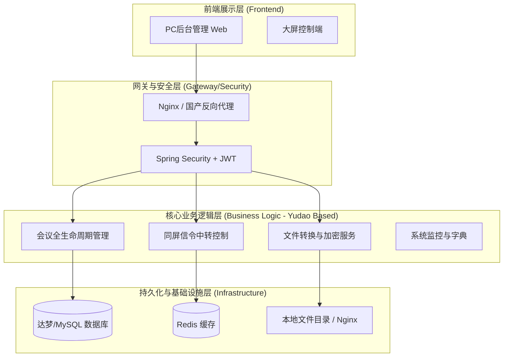

# 无纸化会议系统-管理端架构设计说明书

## 1. 总体设计原则
本系统管理端旨在构建一个稳定、安全、高效且符合国产化（信创）要求的会议控制中枢。
*   **标准化：** 采用行业领先的开源中台框架，确保代码规范与易维护性。
*   **信创适配：** 全链路支持国产芯片、操作系统、数据库及中间件。
*   **高性能：** 针对会议现场高并发同屏、文稿分发等场景进行专项优化。
*   **高安全性：** 采用前后端分离架构，严格的权限控制及文档加密流转。

---

## 2. 技术选型清单

### 2.1 基础研发框架
*   **后端框架：** **Yudao (基于 Spring Boot 3 & MyBatis-Plus)**
    *   *选择理由：* 相比原版 RuoYi，Yudao (RuoYi-Vue-Pro) 提供了更现代的依赖管理、更好的性能优化以及更丰富的组件支持，基于多模块架构，易于扩展业务模块。
*   **前端框架：** **Vue 3 + Element Plus + Vite + Pinia**
    *   *选择理由：* 现代化响应式框架，配合 Vite 构建效率极高，Pinia 作为状态管理更符合 Vue 3 开发规范。
*   **客户端框架：** **Flutter 3（Dart）**
    *   *选择理由：* 一套代码覆盖 Android 平板与 HarmonyOS 兼容生态，便于统一实现会议文稿、同屏控制、批注签名、断网恢复等强交互能力；后续也可根据国产化终端要求衍生 Android APK 与鸿蒙兼容包。

### 2.2 数据存储与任务处理
*   **核心数据库：** 
    *   *开发环境：* MySQL 8.0
    *   *信创环境：* **达梦 (Dameng) V8** 或 **人大金仓 (Kingbase) R6**
*   **缓存中间件：** **Redis** (用于 Token 存储、会议状态实时分布式控制)
*   **文件存储：** **本地文件系统 (Local Storage)**
    *   *优化理由：* 针对低并发、离线内网部署场景，直接利用服务器大容量硬盘进行本地存储，配合 Nginx 进行静态资源访问，架构更轻量且维护成本低。Yudao 已原生支持本地存储。
*   **异步任务处理：** **Spring @Async / 任务线程池**
    *   *优化理由：* 考虑到目前并发压力较小，无需引入繁重的外部消息队列（如 Kafka/RabbitMQ）。文件转换等耗时任务将由 Spring 内置的异步任务框架处理，确保系统轻量化。

### 2.3 消息同步
*   **信令交互：** **WebSocket (Spring Boot WebSocket)**
    *   *功能描述：* 负责管理端与终端平板之间的实时指令下发、同屏翻页数据同步，不经过数据库，直接内存转发。

---

## 3. 信创适配方案
为满足信创系统要求，管理端将确保以下兼容性：
1.  **服务器芯片：** 兼容 **鲲鹏 (ARM64)**、**飞腾** 以及 **海光 (x86)** 架构。
2.  **操作系统：** 完美运行于 **统信 UOS (UnionTech OS)** 和 **银河麒麟 (Kylin OS)** 服务器版。
3.  **中间件容器：** 支持部署在 **东方通 (TongWeb)** 或 **宝兰德 (Besu)** 等国产应用服务器。
4.  **浏览器适配：** 重点适配 **奇安信可信浏览器** 及 **360安全浏览器国产化版**。

---

## 4. 逻辑架构图


---

## 5. 核心业务流程设计

### 5.1 会议资料流转流程
1.  **上传：** 管理员通过 PC 后台（基于 Vue 3）上传 `docx/pptx`。
2.  **存储：** 文件被保存至服务器指定的 **本地磁盘路径** (如 `/home/meeting/upload`)。
3.  **转换：** 触发 **Spring @Async** 异步方法，调用服务器本地安装的 **LibreOffice** 命令行工具，将其转换为多张高清晰度图片或 PDF，并生成特定加密格式。
4.  **分发：** 终端平板通过直连服务器的 HTTP 端口（由 Nginx 映射本地路径）预加载上述转换后的离线包。

### 5.2 同屏指令下发流程
1.  **发起：** 客户端或秘书发出同屏信令。
2.  **处理：** 后台接收指令，在 **Redis** 中更新当前会议的“主控状态（主讲人UID、文件ID、页码）”。
3.  **广播：** 通过 **WebSocket** 建立的长连接，将状态实时推送给会议室内所有在线的平板，实现毫秒级跟随。

---

## 6. 系统运行环境建议
*   **CPU:** 4核及以上 (建议国产芯片)
*   **内存:** 16GB 及以上
*   **磁盘:** 500GB SSD (依据会议资料存储量而定)
*   **网络:** 建议万兆主干 + 现场千兆/高带宽WiFi（确保同屏不卡顿）

---

## 7. 目录结构设计 (Management Console)

管理端采用 Yudao (RuoYi-Vue-Pro) 前后端分离架构，通过多模块方式扩展会议核心业务。


### 7.1 后端模块结构 (Spring Boot 3 / Maven)

```text
paper-meeting-server/
├── yudao-dependencies/           # Maven 依赖管理，定义三方组件版本
├── yudao-framework/              # 框架核心：技术方案的封装 (Web, Security, MyBatis 等)
├── yudao-module-system/          # 系统基础：权限管理、消息中心、部门岗位
├── yudao-module-infra/           # 基础设施：配置、API 日志、代码生成、文件管理
├── yudao-module-meeting/         # [核心业务] 会议全生命周期管理与业务扩展
│   ├── yudao-module-meeting-api/ # 会议业务对外暴露的 API/DTO 模块
│   └── yudao-module-meeting-biz/ # 会议业务核心实现 (Controller, Service, DAL)
│       ├── controller/admin/     # 会议管理管理后台接口
│       ├── controller/app/       # 会议平板端 App 接口
│       ├── dal/                  # 数据操作层 (MySQL/DM, Redis)
│       ├── service/              # 业务逻辑层 (状态流转、LibreOffice 调度)
│       └── convert/              # 实体转换 MapStruct 接口
└── yudao-server/                 # 应用启动入口，负责组装所有业务模块
```

### 7.2 前端工程结构 (Vue 3 / Vite)

```text
paper-meeting-vue3/
├── build/                        # 构建相关：Vite 配置、打包策略
├── public/                       # 静态资源、离线查看器载体
├── src/                          # 源代码
│   ├── api/                      # 接口定义 (按模块划分，如 system, infra, meeting)
│   │   └── meeting/              # 会议管理相关 API
│   ├── components/               # 通用基础组件
│   ├── layout/                   # 页面布局容器 (Sidebar, Navbar)
│   ├── views/                    # 业务视图页面
│   │   ├── system/               # 系统管理页面 (用户、权限)
│   │   └── meeting/              # [业务页面] 会议全流程管控
│   │       ├── info/             # 会议预定、基本信息维护
│   │       ├── agenda/           # 议题排程、文件上传组件
│   │       ├── control/          # 现场秘书控制台
│   │       ├── notification/     # 会中消息管理
│   │       └── template/         # 会议模板管理
│   ├── store/                    # 状态管理 (Pinia)
│   └── utils/                    # 工具函数 (请求封装、权限判断)
├── tsconfig.json                 # TypeScript 配置
└── vite.config.ts                # Vite 配置文件
```

## 8. 当前版本扩展点

### 8.1 管理端剩余需求落地策略
针对需求文档中尚未闭环的管理端能力，本期在既有会议主流程之上补充以下扩展：

1. **会议模板管理**：沿用 `meeting.type=2` 作为模板实体，不额外拆分主表，继续复用深拷贝逻辑复制议题、参会人、资料和表决配置。
2. **消息管理**：新增 `meeting_notification` 表和 `/meeting/notification/*` 接口，支撑会中群发文本消息的草稿、发布与追踪。
3. **公共资料库**：新增 `meeting_public_file` 表和 `/meeting/public-file/*` 接口，用于维护长期共享资料目录。
4. **客户端样式管理**：新增 `meeting_ui_config` 表和 `/meeting/ui-config/*` 接口，用于维护并切换客户端皮肤。
5. **安装包管理**：新增 `meeting_app_version` 表和 `/meeting/app-version/*` 接口，用于维护多端安装包版本矩阵。
6. **会议主表增强**：补充 `control_type`、`require_approval`、`summary`、`archive_time` 字段，用于表达秘书控制、审批策略、会议记录及归档时间。
7. **会议冲突控制**：在创建、修改、提交预约、开始会议环节统一校验会议室时间冲突，避免同一物理会议室并行召开两场未完成会议。
8. **归档规则**：普通会议结束后直接进入归档状态；保密会议结束时自动清理议题、参会人、资料、表决及记录数据，仅保留会议主记录。

### 8.2 菜单落地说明
本期在“会议系统”一级菜单下补充：

*   **消息管理**：面向正在执行或即将执行的会议进行文本通知编排。
*   **会议模板**：集中管理 `type=2` 的模板会议，并支持一键生成新会议。
*   **公共资料库**：维护长期共享资料目录。
*   **客户端样式**：维护并切换客户端视觉模板。
*   **安装包管理**：维护多端安装包版本信息及当前启用版本。

### 8.3 客户端工程结构 (Flutter / Tablet)

客户端采用独立工程 `paper-meeting-client/` 进行建设，与管理端 `paper-meeting-vue3/` 解耦发布。管理端负责会议数据配置、资料上传与控制指令下发；客户端负责平板签到、资料查阅、同屏跟随、表决、签名和秘书控场。两者通过 REST API + WebSocket 进行集成。

```text
paper-meeting-client/
├── android/                      # Android 原生壳工程（APK 构建、权限、签名）
├── harmony/                      # 鸿蒙适配预留目录（兼容层、打包说明）
├── assets/                       # 图片、图标、示例文稿、主题资源
├── lib/                          # Dart 源码
│   ├── app/                      # 应用入口、路由、主题、全局配置
│   ├── core/                     # 常量、工具、异常、网络封装
│   ├── models/                   # 会议、议题、文稿、表决、通知等领域模型
│   ├── repositories/             # 数据仓储层（REST / WebSocket / Mock）
│   ├── state/                    # 全局状态管理（登录态、会议态、同屏态）
│   ├── features/                 # 业务模块
│   │   ├── onboarding/           # 连接设置、会议室/座位绑定
│   │   ├── auth/                 # 登录签到
│   │   ├── home/                 # 会议首页与快捷入口
│   │   ├── info/                 # 会议信息
│   │   ├── document/             # 会议文稿、批注、书签、同屏
│   │   ├── media/                # 视频与公共资料
│   │   ├── vote/                 # 投票表决
│   │   ├── signature/            # 手写签名
│   │   ├── service/              # 呼叫服务
│   │   ├── notice/               # 通知中心
│   │   ├── timer/                # 个人计时器
│   │   └── secretary/            # 秘书控制台
│   └── widgets/                  # 通用 UI 组件
├── test/                         # 单元测试与 Widget 测试
├── pubspec.yaml                  # Flutter 依赖与资源清单
└── README.md                     # 启动、构建、联调说明
```

### 8.4 客户端工程集成说明

1.  **接口分层：** 客户端仅调用 `/app` 范围的轻量接口，避免复用管理端后台权限模型。
2.  **实时通信：** 文稿同屏、表决状态、秘书广播、服务处理回执统一走 WebSocket 消息通道。
3.  **离线策略：** 已下载的会议文稿、通知及基础配置缓存到本地安全目录，断网后仍可维持当前会议查阅。
4.  **安全策略：** 客户端需支持动态水印、退出会议缓存清理、保密会议资料销毁、重连后状态校正。
5.  **发布策略：** 管理端负责提供客户端安装包下载入口；客户端工程独立版本化，便于灰度升级与现场回滚。
