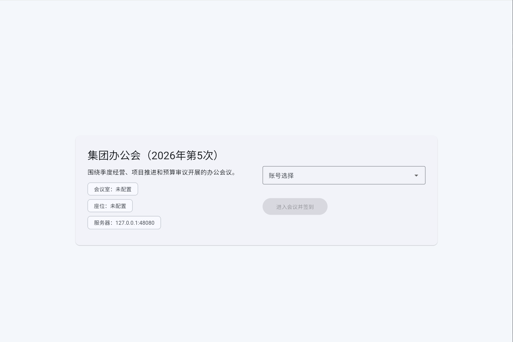
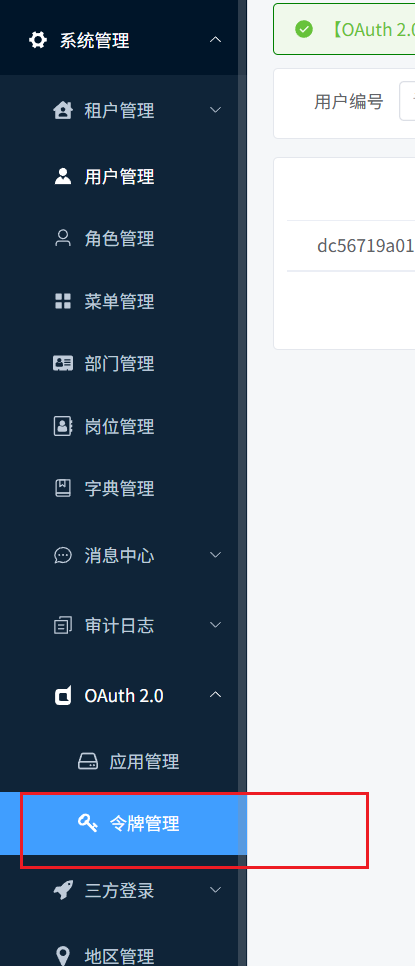
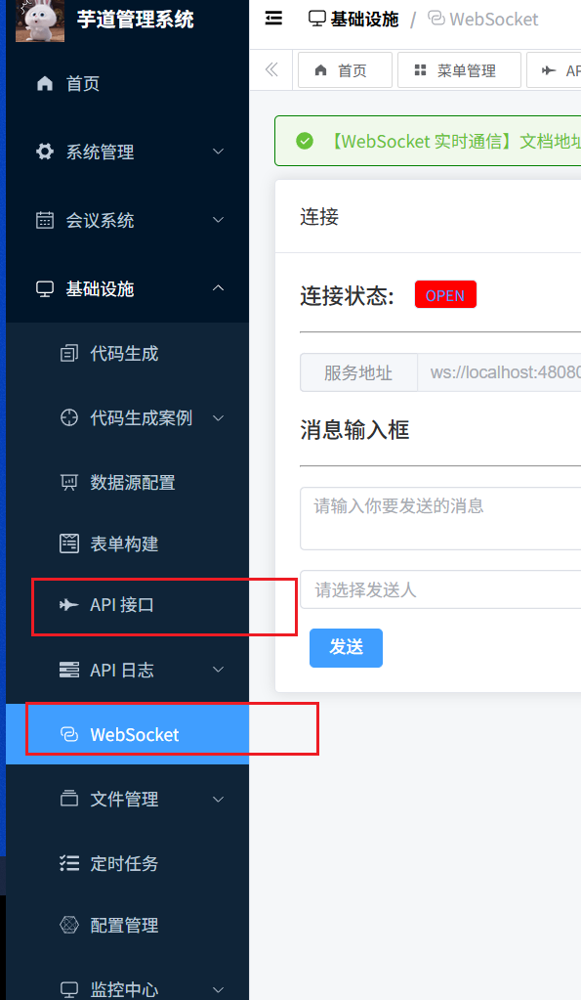

# 详细设计说明书 - Phase 4: 管理端扩展模块

## 1. 目标

本阶段聚焦补齐《无纸化会议系统管理端需求规格说明书》中尚未落地的后台扩展能力，优先覆盖：

*   会中消息管理
*   会议模板管理
*   公共资料库
*   客户端样式管理
*   安装包管理
*   会议主表增强字段
*   会议室时间冲突校验
*   会议首页与会议室占用看板
*   普通/保密会议差异化归档策略

## 2. 会议主表增强

### 2.1 字段扩展

在 `meeting` 表新增以下字段：

| 字段名 | 类型 | 说明 |
| :--- | :--- | :--- |
| control_type | tinyint | 控制方式：0秘书控制、1自由控制 |
| require_approval | bit(1) | 是否需要审批 |
| summary | text | 会议记录 |
| archive_time | datetime | 归档时间 |

### 2.2 状态规则

1.  即时会议默认按“无需审批”路径进入可执行状态。
2.  预约会议若 `require_approval=true`，创建后为草稿，提交预约后进入待审批。
3.  普通会议结束时直接写入 `status=5(已归档)`，同时记录 `archive_time`。
4.  保密会议结束时执行资料清理，仅保留会议主记录与审批轨迹，状态保持 `已结束`。

## 3. 会中消息管理

### 3.1 业务流程

1.  管理员按会议编号创建一条文本通知。
2.  通知先保存为草稿，状态为 `publish_status=0`。
3.  点击“发布”后，系统写入 `published_time` 并置为 `publish_status=1`。
4.  后续可扩展为通过 WebSocket 将已发布通知实时推送到会中终端。

### 3.2 表结构

`meeting_notification`

| 字段名 | 类型 | 说明 |
| :--- | :--- | :--- |
| id | bigint | 主键 |
| meeting_id | bigint | 会议编号 |
| content | text | 通知内容 |
| publish_status | tinyint | 发布状态：0草稿 1已发布 |
| published_time | datetime | 发布时间 |

### 3.3 接口

*   `GET /meeting/notification/page`
*   `GET /meeting/notification/get`
*   `POST /meeting/notification/create`
*   `PUT /meeting/notification/update`
*   `DELETE /meeting/notification/delete`
*   `POST /meeting/notification/publish`

## 4. 会议模板管理

### 4.1 建模方式

会议模板直接复用 `meeting` 主表，约定 `type=2` 表示模板。模板数据具备完整议题、人员、文件、表决配置结构，因此可继续复用现有 `copyMeeting/saveAsTemplate` 深拷贝逻辑。

### 4.2 页面能力

*   模板列表查询
*   新增/编辑模板
*   查看模板详情
*   一键生成会议草稿

## 5. 会议室冲突校验

### 5.1 校验时机

以下动作统一校验同会议室时间重叠：

*   创建会议
*   修改会议
*   提交预约
*   开始会议

### 5.2 判定规则

对同一 `room_id`，若目标会议与状态为“待审批/已预约/进行中”的会议存在区间重叠：

`existing.start_time < current.end_time && existing.end_time > current.start_time`

则禁止继续操作。

## 6. 公共资料库

### 6.1 设计目标

为非临时性制度文件、规范手册、长期参考材料提供统一云端目录，后台可直接录入分类、文件地址、启停状态与排序。

### 6.2 表结构

`meeting_public_file`

| 字段名 | 类型 | 说明 |
| :--- | :--- | :--- |
| id | bigint | 主键 |
| category | varchar(100) | 分类 |
| name | varchar(255) | 资料名称 |
| url | varchar(512) | 文件地址 |
| file_type | varchar(50) | 文件类型 |
| sort | int | 排序 |
| enabled | bit(1) | 启用状态 |

## 7. 客户端样式管理

### 7.1 设计目标

支持后台维护一组客户端视觉主题，包括主色、辅色、字号、背景图、Logo 及扩展 CSS，并允许一键启用。

### 7.2 表结构

`meeting_ui_config`

| 字段名 | 类型 | 说明 |
| :--- | :--- | :--- |
| id | bigint | 主键 |
| name | varchar(100) | 样式名称 |
| font_size | int | 基础字号 |
| primary_color | varchar(20) | 主色 |
| accent_color | varchar(20) | 辅色 |
| background_image_url | varchar(512) | 背景图 |
| logo_url | varchar(512) | Logo |
| extra_css | text | 扩展样式 |
| active | bit(1) | 是否启用 |

启用策略采用“同一时刻仅一套样式有效”，服务端在激活动作中先将全部样式置为未启用，再启用目标配置。

## 8. 安装包管理

### 8.1 设计目标

维护安卓客户端、呼叫服务端、大屏端、信息发布端的版本矩阵，支持上传下载地址、版本号、强制更新标记以及当前生效版本切换。

### 8.2 表结构

`meeting_app_version`

| 字段名 | 类型 | 说明 |
| :--- | :--- | :--- |
| id | bigint | 主键 |
| client_type | tinyint | 客户端类型 |
| name | varchar(100) | 安装包名称 |
| version_name | varchar(50) | 版本名称 |
| version_code | int | 版本号 |
| download_url | varchar(512) | 下载地址 |
| md5 | varchar(64) | 校验值 |
| force_update | bit(1) | 是否强更 |
| active | bit(1) | 是否启用 |

启用策略按客户端类型维度互斥，即同一种客户端只允许一个当前生效版本。

## 9. 前端落地说明

### 9.1 新增页面

*   `src/views/meeting/home/index.vue`
*   `src/views/meeting/notification/index.vue`
*   `src/views/meeting/template/index.vue`
*   `src/views/meeting/public-file/index.vue`
*   `src/views/meeting/ui-config/index.vue`
*   `src/views/meeting/app-version/index.vue`

### 9.2 复用页面

*   模板管理复用 `MeetingForm.vue`
*   模板详情复用 `MeetingDetail.vue`
*   会议首页中的“预定此会议室”复用 `MeetingForm.vue`，通过预设 `roomId/startTime/endTime` 提升录入效率

## 10. 会议首页与会议室占用看板

### 10.1 设计目标

在会议系统模块中补充一个轻量首页，用于集中查看今日会议室占用状态、后续排期、今日会议列表和快捷预定入口，减少用户进入“会议室管理”和“我的会议”后再二次跳转的成本。

### 10.2 接口设计

新增接口：

*   `GET /meeting/room/overview`

返回内容包括：

*   会议室总数
*   当前空闲数
*   当前占用数
*   今日会议数
*   今日待开始会议数
*   每个会议室的当前会议、下一场会议、今日会议数
*   今日会议列表及对应会议室信息

### 10.3 统计规则

1.  统计范围限定为“今日发生交集”的非模板会议。
2.  当前会议判定条件为：
    `start_time <= now <= end_time` 且状态为“已预约/进行中”。
3.  下一场会议判定条件为：
    `start_time > now` 且状态为“待审批/已预约”，按开始时间最早取一条。
4.  停用会议室仅展示状态，不计入“当前空闲数”和“当前占用数”。

## 11. 后续扩展建议

后续可继续在此基础上补充网站贴牌化配置、客户端升级检查接口、消息发布后的 WebSocket 实时推送以及公共资料访问审计。

